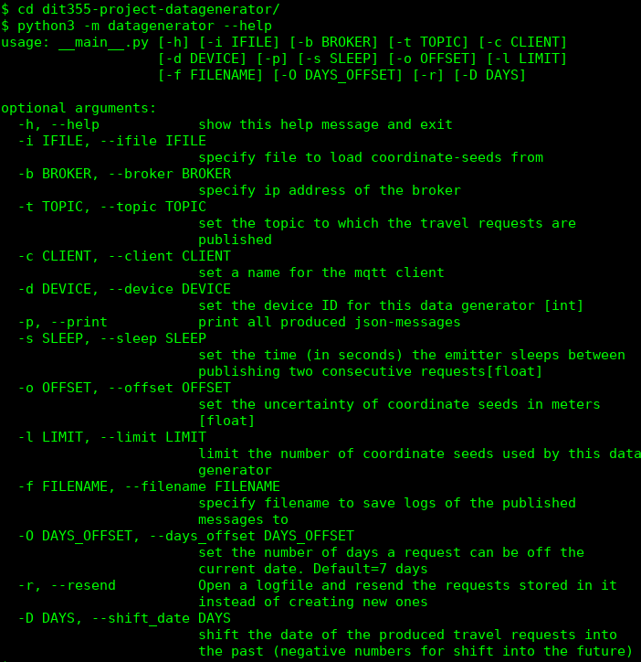

# Datagenerator Creating Random Travel Requests

The datagenerator/emitter of group 9 is a tool to create public transport requests in the greater Gothenburg area.  
By running the main script these requests are continuously published to a MQTT broker at a customizable rate.

This module has been developed using Python 3.  

The following sections will go deeper into the process for installation and usage.

## Installation

### Python 3.6+
First of all you need to make sure to Python 3 is installed on your system.   

**Check your Python Version:**

In order to check whether Python 3 is installed already, go to your command line and run the following command:
```bash
python --version
```

If the result is Python 2.x.x, Python 2 is your system standard. In this case you should check whether Python 3 is installed additionally:
```bash
python3 --version
```
If the result is Python 3.x.x you can either always use the command `python3` to replace the simple `python`. Alternatively you could switch Python 3 to be your system default.  


If neither of these two commands returns Python 3.x.x, you probably need to install Python 3 before continuing with the next steps of the installation. If the release number is lower than 3.7, you should also consider updating your Python to a newer version.  

**Install Python:**  
* To install Python please download a recent version from the  
[Official Python Download Page](https://www.python.org/downloads/)
* Or consult these [Python Installation Instructions](https://realpython.com/installing-python/)  

**Install Python Dependencies:**  

All non-standard Python dependencies for this project are listed in the file [requirements.txt](requirements.txt).
The easiest way to install these dependencies is using pip or pip3 (depending on your systems default Python).
Simply run the corresponding command from your commandline:
```bash
pip install -r requirements.txt
pip3 install -r requirements.txt
```
If this command completes successfully, the correct versions of all necessary dependencies should be installed on your system.  

**Install Tkinter:**  

Tkinter is a Python framework for user interfaces. 
If it is not installed with your standard python distribution, you might need to take some additional steps to install it.
You can find install instructions for your OS in the [tkdocs](https://tkdocs.com/tutorial/install.html).  
 
For instance it can be installed on Linux using your distribution's package manager:  

```bash
sudo apt-get install python3-tk
```

Now you should be able to execute the datagenerator without any problems.

## Usage

There are a few things you can do with the datagenerator. 
To run the script you ideally open a commandline in the top-level directory of this project. 
From there you can simply run the project and pass parameters in the commands.  

To get an idea of the available parameters, ask for help using the flag -h or --help:
```bash
python3 -m datagenerator --help
```
The result should look like this:  


## The data generator is written in Python

The following packages are required:
- Spaceholder A --version 1.2
- Spaceholder B --version 1.0

## Support

If you have any questions regarding this specific module,
please contact the lead developer of this module, [Konrad Otto](mailto:gusottko@student.gu.se), 
or the co-developer and maintainer, [Armin Ghoroghi](arre2118@gmail.com).

## Authors and Acknowledgment

This module is part of the distributed system for Visual Transportation Support 
developed by Clusterrot (Group 9) during the course 
DIT355 Miniproject: Distributed Systems at the University of Gothenburg.  
The system was implemented from November 2019 through January 2020.  

Clusterrot consists of the following members:
- Tobias Bank
- Armin Ghoroghi
- Simon Johansson
- Kardo Marof
- Jean Paul Massoud
- Konrad Otto

### Documentation

* To access Diagrams and Documentaion please visit [Documentaion](https://git.chalmers.se/courses/dit355/2019/group-9/dit355-project-documentation)
 

[//]: # (The structure of this file has been inspired by the suggestions on https://www.makeareadme.com/) 
